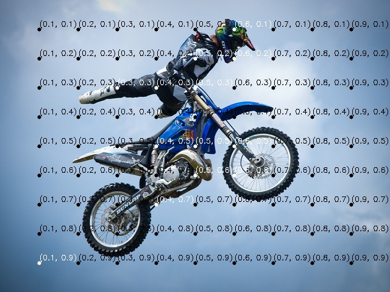
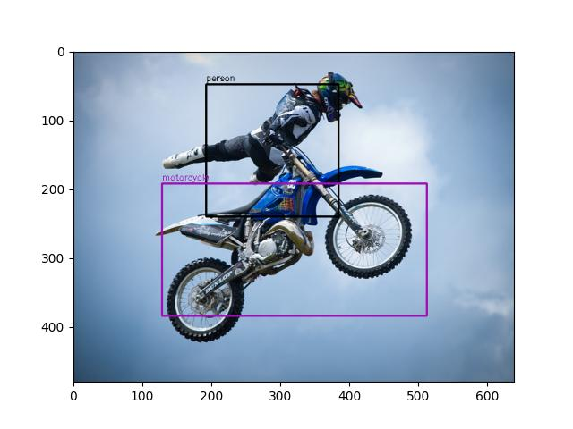

# gpt-object-detection

## Requirements
- Python 3.12
- Poetry

## Installation
```bash
poetry install
```

## Usage
```bash
poetry run python main.py --image <image_path> --labels <label_list> [--use_dot_matrix true]
```

### Example
```bash
poetry run python main.py --image target.jpg --labels person, motorcycle --use_dot_matrix true
```

### Image with Dot Matrix


### Result


